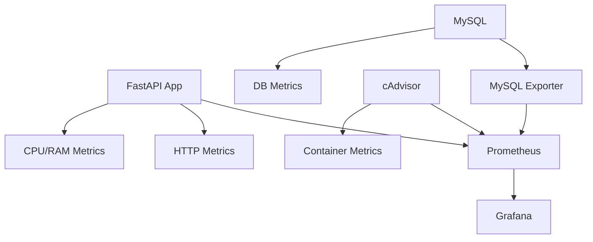

# � Agenda API com Monitoramento

Uma API REST moderna para gerenciar contatos de agenda com sistema completo de monitoramento e observabilidade.

## ✨ Features

- ✅ **API REST Completa** com FastAPI
- ✅ **Operações CRUD** para contatos da agenda
- ✅ **Validação de Dados** com Pydantic
- ✅ **Armazenamento em Memória** (sem banco de dados)
- ✅ **Documentação Automática** (Swagger/OpenAPI)
- ✅ **Containerização** com Docker
- ✅ **Monitoramento Completo** com Prometheus + Grafana
- ✅ **Agregação de Logs** com Loki + Promtail
- ✅ **Logging Estruturado** em JSON
- ✅ **Métricas do Sistema** (CPU, memória, disco)
- ✅ **Métricas da Aplicação** (requests, latência)
- ✅ **Health checks** e observabilidade completa

## 🚀 Technologies

### Backend
- **FastAPI** - Framework web moderno e de alta performance
- **Pydantic** - Validação e serialização de dados
- **Uvicorn** - Servidor ASGI de alta performance
- **Python** - Linguagem de programação

### Monitoramento & Observabilidade
- **Prometheus** - Sistema de monitoramento e alertas
- **Grafana** - Visualização de métricas e dashboards
- **Loki** - Agregação e armazenamento de logs
- **Promtail** - Coleta de logs dos containers

### DevOps
- **Docker & Docker Compose** - Containerization and orchestration
- **Git** - Version control

## 📊 Monitoring Architecture



### Portas dos Serviços
| Serviço | Porta | URL |
|---------|-------|-----|
| **Agenda API** | 8888 | http://localhost:8888 |
| **Grafana** | 3000 | http://localhost:3000 |
| **Prometheus** | 9090 | http://localhost:9090 |

## ⚡ Quick Start

### Prerequisites
- [Docker](https://docs.docker.com/get-docker/) and [Docker Compose](https://docs.docker.com/compose/install/)
- [Git](https://git-scm.com/)

### Cloning and Running

```bash
# Clone o repositório
git clone https://github.com/yourusername/agenda-api-monitoring.git
cd agenda-api-monitoring

# Execute todos os serviços
docker-compose up --build -d

# Verifique o status dos containers
docker-compose ps
```

### 🎯 Acesso Rápido

Após inicialização completa (~2 minutos):

- **📚 Docs da API:** http://localhost:8888/docs
- **📊 Grafana:** http://localhost:3000 (admin/admin)
- **🔍 Prometheus:** http://localhost:9090
- **📋 Loki:** http://localhost:3100
```
```

## 🌐 Endpoints da API

### 📇 Contatos

| Método | Endpoint | Descrição | Status |
|--------|----------|-----------|---------|
| `POST` | `/contatos` | Criar novo contato | 201 |
| `GET` | `/contatos` | Listar todos os contatos | 200 |
| `GET` | `/contatos/{id}` | Buscar contato por ID | 200 |

### 🔧 Sistema

| Método | Endpoint | Descrição |
|--------|----------|-----------|
| `GET` | `/` | Informações da API |
| `GET` | `/health` | Verificação de saúde |

## 📈 Monitoramento e Métricas

### 🎯 Métricas Coletadas

#### Aplicação (FastAPI)
- **Requisições HTTP:** Total, por status, por endpoint
- **Latência:** P50, P95, P99 tempo de resposta
- **CPU & Memória:** Uso de recursos da aplicação

#### Logs (Loki + Promtail)
- **Logs Estruturados:** Todos os logs em formato JSON
- **Eventos da API:** Criação, listagem, busca de contatos
- **Requisições HTTP:** Método, URL, status, tempo de resposta
- **Histórico Completo:** Todos os eventos são armazenados

#### Infraestrutura (Containers)
- **CPU:** Uso por container
- **Memória:** Uso vs limite
- **I/O:** Leitura/escrita em disco
- **Rede:** Tráfego de rede


### 🔍 Consultas Úteis (Prometheus)

```promql
# Requisições por segundo
rate(http_requests_total[5m])

# CPU da API
container_cpu_usage_seconds_total{name="agenda-api"}

# Memória da API (MB)
container_memory_usage_bytes{name="agenda-api"} / 1024 / 1024
```

## 📁 Project Structure

```
agenda-api-monitoring/
├── 📁 app/                          # Código da aplicação
│   └── main.py                      # Aplicação FastAPI com logging
├── 📁 monitoring/                   # Configurações de monitoramento
│   ├── prometheus.yml               # Config do Prometheus
│   ├── loki-config.yml              # Config do Loki
│   ├── promtail-config.yml          # Config do Promtail
│   └── 📁 grafana/
│       └── 📁 provisioning/
│           └── 📁 datasources/
│               ├── prometheus.yml   # Fonte de dados Prometheus
│               └── loki.yml         # Fonte de dados Loki
├── docker-compose.yml               # Orquestração completa
├── Dockerfile                       # Imagem da API
├── requirements.txt                 # Dependências Python
└── README.md                        # Esta documentação
```

## 💻 Exemplos de Uso

### Criar um Contato
```bash
curl -X POST "http://localhost:8888/contatos" \
     -H "Content-Type: application/json" \
     -d '{
       "nome": "João Silva",
       "telefone": "(11) 99999-9999",
       "email": "joao@email.com",
       "endereco": "Rua das Flores, 123"
     }'
```

### Listar Todos os Contatos
```bash
curl "http://localhost:8888/contatos"
```

### Buscar Contato por ID
```bash
curl "http://localhost:8888/contatos/{id}"
```

### Verificar Status da API
```bash
curl "http://localhost:8888/"
```

### Health Check
```bash
curl "http://localhost:8888/health"
```

### Verificar Métricas do Sistema
```bash
curl "http://localhost:8888/system-metrics"
```

### Métricas do Prometheus
```bash
curl "http://localhost:8888/metrics"
```

## 📋 Logs Estruturados

A API gera logs estruturados em JSON que incluem:

### Eventos Capturados:
- **Requisições HTTP:** Início e fim de cada requisição
- **Operações de Contatos:** Criação, busca, listagem
- **Métricas de Performance:** Tempo de resposta
- **Erros e Alertas:** Contatos não encontrados

### Exemplo de Log:
```json
{
  "timestamp": "2025-10-02 14:30:45",
  "level": "INFO",
  "event": "contact_created",
  "contact_id": "abc-123",
  "contact_name": "João Silva",
  "total_contacts": 5
}
```


<div align="center">

**⭐ If this project was helpful, consider giving it a star!**

Developed with ❤️ by [Eliza Augusta](https://github.com/elizaaugusta4)

</div>